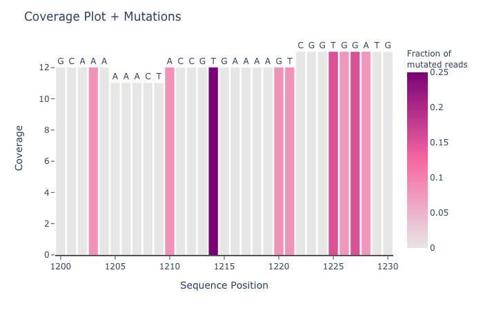
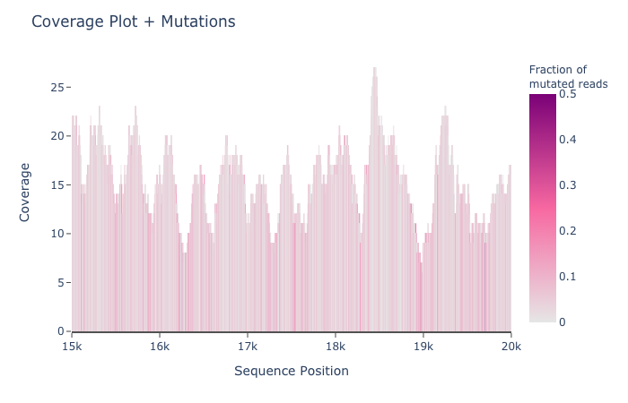

# Sequence Coverage Plot with Python and Plotly

Author: Jamilla Akhund-Zade

Efficient calculation of sequence coverage given read alignment and interactive visualization of coverage annotated with mutations. Inspired by implementation in [Integrative Genome Viewer](https://software.broadinstitute.org/software/igv/UserGuide). 

[View Interactive Plot of Small Region of Interest](https://jamilla-az.github.io/sequence-coverage-plot/small_region.html)

[View Interactive Plot of Large Region of Interest](https://jamilla-az.github.io/sequence-coverage-plot/small_region.html)
